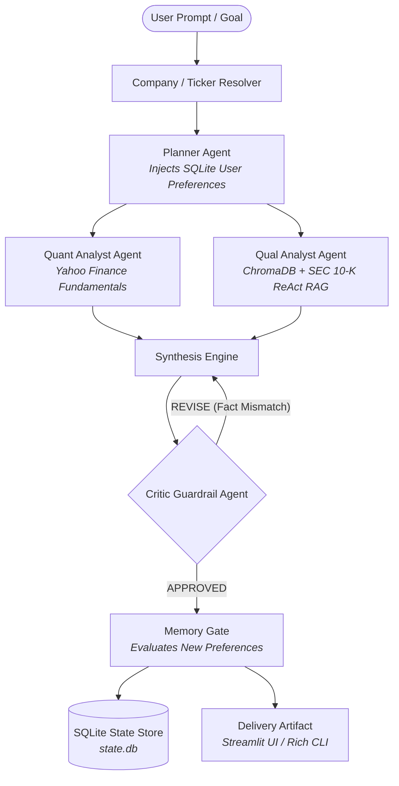

# Autonomous FinTech Equity Research Analyst

An institutional-grade, multi-agent financial research system built on a headless, model-agnostic architecture. The agent autonomously ingests SEC Form 10-K filings, queries real-time market multiples, maintains cross-session episodic memory, validates statements via critic guardrails, and exports verified investment memoranda.

---

## Architecture Overview



The system separates core execution logic from external presentation layers, allowing seamless operation across CLI, web dashboards, and CI/CD pipelines.

---

## Core Capabilities

- **Universal LLM Gateway**: Unified adapter interface supporting Google Gemini, OpenAI, and Anthropic models with zero application-level code modifications.
- **Company-to-Ticker Resolver**: Resolves informal corporate names (e.g., *"Apple"*, *"Taiwan Semiconductor"*, *"Microsoft"*) to verified exchange tickers using the official SEC EDGAR registry, Yahoo Finance search, and LLM fallback.
- **Autonomous SEC RAG Pipeline**: Downloads raw Form 10-K filings directly from SEC EDGAR, parses critical sections (Item 1: Business, Item 1A: Risk Factors, Item 7: MD&A), and stores vector embeddings locally in ChromaDB.
- **Episodic SQLite Memory**: Tracks session scratchpads, raw citation text, and extracts persistent behavioral preferences (e.g., compulsory bear-case scenarios, debt-to-equity tracking) across runs.
- **Self-Healing Critic Loop**: Automated critic agent verifies draft factual assertions against raw filing text and market multiples, demanding iterative revisions upon failure.
- **Dual-Layer Evaluation Suite**:
  - **Probabilistic Gate**: Evaluates claim entailment and hallucination rate using Ragas (LLM-as-a-judge).
  - **Deterministic Gate**: Strict pytest suite validating Markdown formatting, table row counts, cell completeness, and critic approval status.
- **Telemetry & AIOps**: Automatic function-level tracing through Langfuse capturing token consumption, execution latency, and step-by-step tool invocation waterfalls.

---

## Directory Structure

```plaintext
equity-research-analyst/
├── app.py                      # Interactive Streamlit Web Cockpit
├── run.py                      # CLI entrypoint runner
├── pyproject.toml              # Dependencies, packaging, and test configuration
├── requirements.txt            # Python package specifications
├── .env.example                # Template for environment variables and API keys
├── README.md                   # System documentation and architecture guide
│
├── data/
│   ├── state.db                # SQLite persistent store (scratchpads & episodic memory)
│   ├── sec_tickers.json        # Cached SEC EDGAR company-to-ticker mapping (~10k companies)
│   ├── raw_filings/            # Cached raw SEC EDGAR HTML/text filings
│   └── vector_store/           # Persistent ChromaDB vector index for 10-K chunks
│
├── src/
│   ├── agents/
│   │   ├── planner.py          # Goal breakdown & memory rule injection
│   │   ├── quant_analyst.py    # Multiples & balance sheet metrics (yfinance)
│   │   ├── qual_analyst.py     # ReAct tool-calling loop over SEC filings
│   │   ├── critic.py           # Verification & guardrail enforcement
│   │   └── state.py            # Typed agent scratchpad definitions
│   │
│   ├── core/
│   │   └── loop.py             # State machine & orchestrator
│   │
│   ├── gateways/
│   │   └── cli.py              # Typer + Rich terminal interface
│   │
│   ├── llm/
│   │   ├── gateway.py          # Unified LLM provider router (Gemini, OpenAI, Anthropic)
│   │   └── schema.py           # Pydantic schemas for requests, responses & tool calls
│   │
│   ├── memory/
│   │   ├── sqlite_store.py     # Local SQLite database access layer
│   │   └── memory_gate.py      # Cross-session preference learner & evaluator
│   │
│   ├── rag/
│   │   ├── retriever.py        # ChromaDB querying & section search
│   │   ├── store.py            # FinancialVectorStore ChromaDB manager
│   │   └── sec_fetcher.py      # SEC EDGAR downloader & section splitter
│   │
│   └── tools/
│       ├── resolver.py         # Company name to stock ticker resolver
│       ├── market_data.py      # Yahoo Finance fundamental multiples & price history
│       └── parser.py           # 10-K HTML/text document cleaning & chunking
│
├── evals/
│   ├── test_faithfulness.py    # Ragas semantic evaluation gate (LLM-as-a-judge)
│   └── test_deterministic.py   # Regex & structural layout release gate
│
├── tests/
│   └── test_resolver.py        # Ticker & company name resolver unit test suite
│
└── ops/
    └── telemetry.py            # Langfuse telemetry decorator & tracing
```

---

## Tech Stack

| Domain | Technologies |
|---|---|
| **Runtimes & Package Management** | Python 3.11, `uv`, `pip` |
| **Orchestration & State** | Pure Python state machines, `pydantic` |
| **LLM Integration** | Google GenAI SDK (`google-genai`), LangChain provider adapters |
| **Vector Database & Embeddings** | ChromaDB (`chromadb`) |
| **Financial & Regulatory Data** | `yfinance`, `sec-edgar-downloader`, SEC EDGAR API |
| **Observability & Telemetry** | Langfuse (`langfuse`) |
| **Evaluation & Quality Assurance** | Ragas (`ragas`), Pytest (`pytest`) |
| **Presentation Layers** | Streamlit, Typer, Rich |

---

## Installation & Setup

### 1. Clone & Environment Setup

```bash
git clone https://github.com/<your-username>/equity-research-analyst.git
cd equity-research-analyst

# Create virtual environment using uv or standard venv
uv venv .venv

# Activate virtual environment
# On Linux/macOS:
source .venv/bin/activate
# On Windows (PowerShell):
.\.venv\Scripts\Activate.ps1

# Install project dependencies
uv pip install -r requirements.txt
```

### 2. Environment Configuration

Create a `.env` file in the root directory (refer to `.env.example`):

```ini
# Primary LLM Provider: "gemini" | "openai" | "anthropic"
RESEARCH_LLM_PROVIDER=gemini

# Model Selection
DEFAULT_MODEL=gemini-2.5-flash
FAST_MODEL=gemini-2.5-flash

# Model API Keys (configure the ones you intend to use)
GEMINI_API_KEY=your_gemini_api_key_here
OPENAI_API_KEY=your_openai_api_key_here
ANTHROPIC_API_KEY=your_anthropic_api_key_here

# SEC Edgar Downloader Authentication (Format: "Name AdminEmail@domain.com")
SEC_USER_AGENT="ResearchBot user@example.com"

# Local Storage Paths
SQLITE_DB_PATH="data/state.db"
CHROMA_PERSIST_DIR="data/vector_store"

# Langfuse Observability (Optional)
LANGFUSE_PUBLIC_KEY=pk-lf-...
LANGFUSE_SECRET_KEY=sk-lf-...
LANGFUSE_HOST="https://cloud.langfuse.com"
```

---

## Usage

### 1. Interactive Web Cockpit (Streamlit)

Launch the web browser interface with live execution waterfalls, metric cards, and filing citation inspectors:

```bash
streamlit run app.py
```

Navigate to `http://localhost:8501`. Type any company name (e.g. *"Apple"*, *"Taiwan Semiconductor"*) or ticker (`NVDA`, `MSFT`) along with your research directive.

### 2. Terminal CLI

Execute research tasks directly from the command line using either stock tickers or company names:

```powershell
# Research using direct ticker symbol
python run.py NVDA "Analyze gross margin pressure, Blackwell ramp, and autonomous driving potential."

# Research using company name (automatically resolved to ticker)
python run.py "Taiwan Semiconductor" "Analyze gross margin expansion and geopolitical risk."

# Research using informal brand name
python run.py "Tesla" "Evaluate vehicle delivery trends and regulatory credit reliance."
```

---

## Verification & Release Gates

Execute deterministic and probabilistic evaluation gates before deployment or committing:

```powershell
# 1. Structural Deterministic Gate (validates table formatting, row counts, headings, and critic verdict)
python -m pytest evals/test_deterministic.py -v

# 2. Company Resolver Unit Tests (validates direct symbols, SEC registry, and company name mapping)
python -m pytest tests/test_resolver.py -v

# 3. Ragas Semantic Faithfulness Gate (asserts >= 0.85 claim entailment using LLM-as-a-judge)
python -m pytest evals/test_faithfulness.py -s
```

---

## Inspecting Local Memory & Traces

### SQLite Inspection

Inspect stored scratchpads and learned behavioral preferences across runs:

```powershell
# View active learned preferences extracted by MemoryGate
python -c "import sqlite3; conn = sqlite3.connect('data/state.db'); print(conn.cursor().execute('SELECT key, value FROM memories').fetchall())"

# View saved scratchpad sessions
python -c "import sqlite3; conn = sqlite3.connect('data/state.db'); print(conn.cursor().execute('SELECT session_id, ticker, timestamp FROM scratchpads').fetchall())"
```

### Langfuse Telemetry

Open your project at [cloud.langfuse.com](https://cloud.langfuse.com/) to inspect:
- End-to-end execution latency waterfalls.
- Token consumption and cost breakdowns per sub-agent (`Planner`, `Quant`, `Qual`, `Critic`, `MemoryGate`).
- ReAct tool invocation sequences and SEC retrieval context chunks.
